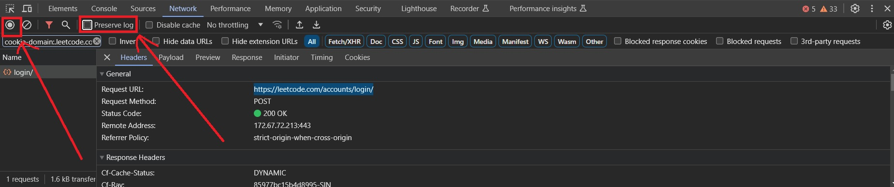

# AutoCrawlLC

## Fetch a specific leetcode question then put them into a Markdown file

## Manual add cookie for premium questions
- Visit "https://leetcode.com/accounts/login/"
- Prevent Chrome auto redirecting so network log is lost by
    - Tick in preserve log
    - Pause recording network
    - 
- Login, get the Set Cookie from POST https://leetcode.com/accounts/login/
- Name the file as cookie_lc together with binary with content as json

```json
[
  {
    "name": "LEETCODE_SESSION", 
    "value": "FILL_HERE_", 
    "path": "/", 
    "domain": ".leetcode.com",
    "secure": true
  },
  {
    "name": "csrftoken", 
    "value": "FILL_HERE_", 
    "path": "/", 
    "domain": ".leetcode.com", 
    "secure": true
  }
]
```
